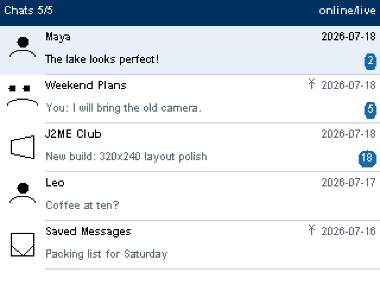
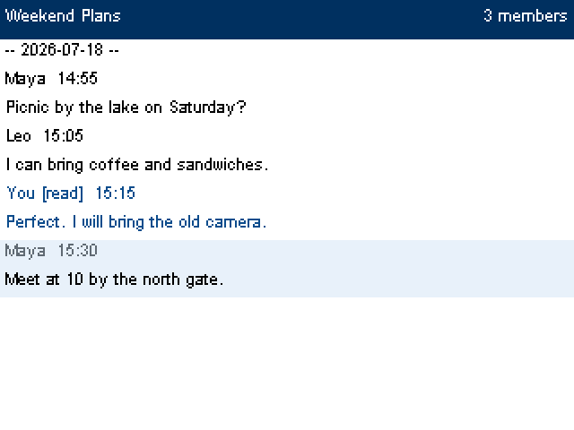
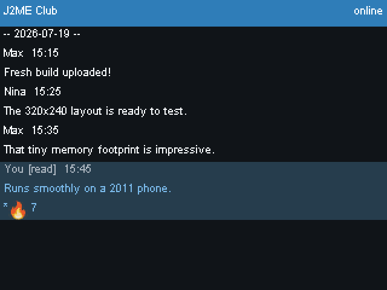

# TelegramJ2ME

Telegram messaging on phones from the Java ME era.

TelegramJ2ME is an experimental client that speaks **MTProto 2.0 directly on
the handset**. It supports direct TCP, obfuscated2, classic/`dd`/`ee` MTProxy
and MTProto over HTTP with automatic fallback. Cryptography, authorization
keys, TL serialization and Telegram state all remain on the device—there is no
application backend or web wrapper.

The code targets the CLDC 1.1 / MIDP 2.0 API subset and uses an adaptive Canvas
UI, including a 320×240 landscape layout.

<p align="center">
  
  
  
</p>

<p align="center"><sub>Real application UI at 320×240, scaled 2×. Every name and conversation is fictional.</sub></p>

> [!WARNING]
> TelegramJ2ME is an independent, early-stage project. It is not affiliated
> with or endorsed by Telegram, and it should not yet be treated as a
> security-audited everyday client.

> [!NOTE]
> Runtime testing has only been performed in MicroEmulator. TelegramJ2ME has
> not yet been tested on a physical Java ME phone, so hardware compatibility,
> performance, permissions and installation behaviour remain unverified.

---

## Quick start

```powershell
./tools/bootstrap.ps1              # JDK 8 check + pinned SDK downloads
./tools/build.ps1 -Target probe    # -> dist/probe.jar + dist/probe.jad
./tools/run-emulator.ps1 -Target probe
./tools/test.ps1                   # desktop test suite
./tools/render-showcase.ps1        # regenerate fictional README screenshots
```

### Prerequisites

| Tool | Why | How |
|---|---|---|
| **JDK 8** | JDK 9+ removed `-source 1.3` / `-target 1.1`, which CLDC needs | `winget install --id EclipseAdoptium.Temurin.8.JDK --exact` |
| **Python 3** | build-side checks, TL generator, dev servers | any 3.8+ |
| **PowerShell 7** | build scripts | ships with Windows 11 |

Everything else - MicroEmulator, ProGuard, the Bouncy Castle `BigInteger`
source - is downloaded by `bootstrap.ps1` from the pins in
[tools/sdk.lock.json](tools/sdk.lock.json), SHA-256 verified, and never
committed.

### Optional: Sun WTK 2.5.2_01

The reference MIDP/CLDC toolkit. Not required, but it upgrades two things from
"approximated" to "exact": the compile-time API surface and the preverifier.

1. [Oracle Java ME archive](https://www.oracle.com/java/technologies/java-archive-downloads-javame-downloads.html) (free Oracle account needed)
2. install `sun_java_wireless_toolkit-2.5.2_01-win.exe`
3. `setx WTK_HOME "C:\WTK2.5.2_01"` and re-run `bootstrap.ps1`

The build detects it automatically and switches to WTK's `cldcapi11.jar` /
`midpapi20.jar` and `preverify.exe`. See [docs/toolchain.md](docs/toolchain.md).

---

## What builds

| Artifact | Size | Contents | Use |
|---|---|---|---|
| `dist/probe.jar` | ~38 KB | `ProbeMidlet` + diagnostics | first install on unknown hardware: platform, heap, RMS, keys, network |
| `dist/crypto.jar` | ~54 KB | + the crypto stack | vectors and benchmarks on the device |
| `dist/tg.jar` | ~193 KB | full client | the messenger |

`probe.jar` deliberately excludes crypto and Telegram code so ProGuard shrinks
it to something small enough to sideload and reinstall quickly on a 2011 phone.

```powershell
./tools/build.ps1 -Target probe
./tools/build.ps1 -Target crypto
./tools/build.ps1 -Target tg -Env production
```

### Live testing against real servers

Protocol work runs against Telegram's test data centres, which need no account:

```powershell
./tools/live.ps1 handshake   # req_pq_multi .. dh_gen_ok
./tools/live.ps1 config      # encrypted session + help.getConfig
./tools/live.ps1 obfs-config # direct obfuscated2
./tools/live.ps1 http-config # MTProto over HTTP
./tools/test-local-mtproxy.ps1 # classic, dd and ee local-proxy E2E
```

Anything past authorization needs a real account; see Telegram's official
[authorization documentation](https://core.telegram.org/api/auth):

```powershell
./tools/build.ps1 -Profile desktop -Env production
./tools/live.ps1 login <international-number>
./tools/live.ps1 dialogs
./tools/live.ps1 send "hello"
./tools/live.ps1 updates -Env production 120
```

---

## Layout

```
src/tg/            device code - CLDC 1.1 subset only
    app/           MIDlet lifecycle, composition root
    ui/            lcdui screens
    plat/          MIDP adapters: sockets, RMS, capability probing
    diag/          log ring, crash persistence
    io/            Transport contract, byte helpers
    crypto/        SHA-1/256/512, HMAC, PBKDF2, AES/CTR/IGE, RNG, bigint
    tl/            TL serialization
    mt/            MTProto transport, session, auth key
    api/           Telegram API layer
test/tgtest/       desktop-only harness (runs the same src/)
tools/             build, bootstrap, dev servers, TL generator
config/            ProGuard configs, CLDC API allow-list, app.properties
third_party/bc/    vendored BigInteger + upstream provenance
```

### The two build profiles

Both compile the *same* `src/` tree.

* **device** - `javac -source 1.3 -target 1.1` against the CLDC/MIDP
  bootclasspath, then `check-api.py`, then ProGuard `-microedition`
  (preverify + shrink), then JAR + JAD with an exact `MIDlet-Jar-Size`.
* **desktop** - plain JDK 8, plus `test/`. Because everything above
  `tg.io.Transport` is pure CLDC-subset Java, the crypto, TL and MTProto layers
  can be driven against a real Telegram data centre from a desktop JVM, with a
  real debugger, before any handset is involved.

`tg.io.Transport` remains the byte-stream seam: `tg.plat.MidpTransport` on the
device, `tgtest.SeTransport` on the desktop. `tg.mt.MtLink` is the packet seam
shared by TCP framing, FakeTLS and request/response HTTP.

### Why `check-api.py`

Without WTK the device build has to fall back to JDK 8's `rt.jar` for
`java.lang`/`java.io`/`java.util`, which is a huge superset of CLDC 1.1. A
`StringBuilder`, a `System.nanoTime()` or an autoboxed `Integer` would compile
cleanly and then fail on the phone. `tools/check-api.py` reads the constant pool
of every compiled class and rejects anything outside
[config/cldc11-midp20-api.txt](config/cldc11-midp20-api.txt).

---

## Credentials

`api_id` / `api_hash` come from [my.telegram.org](https://my.telegram.org)
(see [obtaining_api_id](https://core.telegram.org/api/obtaining_api_id)).

```powershell
Copy-Item config/telegram.yaml.example secrets/telegram.yaml
# then fill in api_id and api_hash
```

`tools/build.ps1` reads that file and emits `generated/tg/app/Secrets.java`.
Both `secrets/` and `generated/` are gitignored, so the values reach the JAR
without ever reaching git — `bootstrap.ps1` verifies that and fails if the
secrets file is not ignored.

**Never** commit `api_id`, `api_hash`, a phone number, or an `auth_key`.

Before publishing or contributing, run the repository audit:

```powershell
./tools/audit-public.ps1
```

It checks the complete would-be commit set, verifies that private directories
are excluded, looks for common credential formats and confirms that exact
values from local secret files do not appear elsewhere. Match contents are
never printed.

Which data centres a build talks to is a build flag, not a config value: an
`auth_key` is bound to one environment, so flipping it at runtime with a stale
key in RMS would fail confusingly.

```powershell
./tools/build.ps1 -Target tg              # -Env test (default)
./tools/build.ps1 -Target tg -Env production
```

DC addresses themselves are public and live in [src/tg/mt/Dc.java](src/tg/mt/Dc.java),
under git — but only as bootstrap entries. The authoritative list comes from
`help.getConfig`.

---

## Status

TelegramJ2ME is an emulator-tested prototype. It builds as a preverified MIDP
JAR/JAD and currently includes:

- on-device MTProto 2.0 cryptography, TL serialization and session state;
- authorization, dialogs, history, text messaging and read state;
- direct, obfuscated2, MTProxy/FakeTLS and HTTP transport routes;
- reconnect handling, a persistent outbox, drafts and update state;
- photos, emoji, reactions, profiles and adaptive light/dark/high-contrast UI.

The desktop harness contains 26 automated suites for crypto, serialization,
transport, persistence, authorization, content and UI logic. These tests and
MicroEmulator runs do **not** establish compatibility with any physical phone.

---

## Legal

Third-party clients must comply with the
[Telegram API Terms](https://core.telegram.org/api/terms): use your own
`api_id`, follow the
[MTProto security guidelines](https://core.telegram.org/mtproto/security_guidelines),
and do not use the official Telegram logo or imply official status. Telegram is
a trademark of Telegram Messenger Inc.

Vendored third-party code and its licences are recorded in
[third_party/bc/UPSTREAM.md](third_party/bc/UPSTREAM.md) and
[third_party/noto-emoji/UPSTREAM.md](third_party/noto-emoji/UPSTREAM.md).
No SDK binary is committed to this repository.

Project code is released under the [WTFPL](LICENSE). Vendored components remain
under their respective upstream licences.
